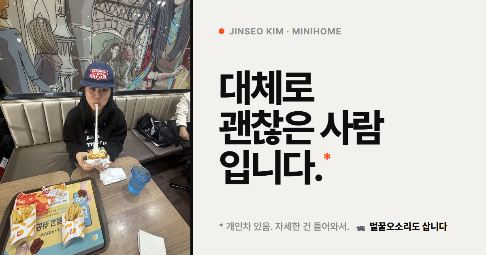

# 김진서 미니홈피

> 대체로 괜찮은 사람입니다.\*
> \* 개인차 있음. 자세한 건 들어와서 보시면 됩니다.

🔗 **https://xormrjjin-debug.github.io/minihome/**



---

## 기본 정보

| 항목 | 내용 |
|---|---|
| 이름 | 김진서 · Jinseo Kim |
| 출생 | 익산 |
| MBTI | ESTJ |
| 혈액형 | A형 |
| 별명 | 벌꿀오소리 (성격이 비슷해서 생겼습니다) |
| 이름 뜻 | 진리를 펼쳐라 |
| 주량 | 3병 (알아서 믿으십쇼) |
| 이메일 | jjin0315@jnu.ac.kr |
| 인스타그램 | [@gamaake](https://instagram.com/gamaake) |

---

## 페이지

| 페이지 | 내용 |
|---|---|
| [Home](https://xormrjjin-debug.github.io/minihome/) | 프로필, TODAY · TOTAL, 오늘의 기분, BGM, 미니룸, 최근 소식 |
| [TMI](https://xormrjjin-debug.github.io/minihome/tmi.html) | 알아도 딱히 도움은 안 됩니다. |
| [A Day](https://xormrjjin-debug.github.io/minihome/day.html) | 하루는 대체로 비슷하게 흘러갑니다. |
| [Quotes](https://xormrjjin-debug.github.io/minihome/quotes.html) | 남들이 그러는데 제가 이렇답니다. |
| [Manual](https://xormrjjin-debug.github.io/minihome/manual.html) | 다루기 어렵지 않습니다. |
| [Someday](https://xormrjjin-debug.github.io/minihome/someday.html) | 언젠가는 할 겁니다. |
| [FAQ](https://xormrjjin-debug.github.io/minihome/faq.html) | 자주 묻는 질문. 사실 아무도 안 물어봤습니다. |
| [Gallery](https://xormrjjin-debug.github.io/minihome/gallery.html) | 사진은 대체로 잘 나온 것만 올립니다. |
| [Play](https://xormrjjin-debug.github.io/minihome/play.html) | 눌러 보셔도 됩니다. |
| [업데이트 기록](https://xormrjjin-debug.github.io/minihome/log.html) | 대체로 꾸준합니다. |
| [Ask ↗](https://docs.google.com/forms/d/e/1FAIpQLScuwm5VR3iKkkGPxskPZ88LTEF3181ZZtfGfy6gkGc3ohsI6Q/viewform) | 궁금한 게 있으면 물어보셔도 됩니다. |

---

## TMI

| 항목 | 내용 |
|---|---|
| 😈 쓸데없는 특기 | **사람 괴롭히기.** 친한 사람한테만 합니다. |
| ✈️ 요즘 빠져 있는 것 | **여행.** 다녀오면 바로 다음 갈 곳을 찾아봅니다. |
| ☕ 아무도 모르는 습관 | **커피 중독.** 사실 다들 압니다. |
| ⏰ 알람 | **다섯 개 이상** 맞춥니다. 첫 번째 알람에 일어난 적은 없습니다. |
| 😴 잠 | 많이 자면 하루에 **12시간** 잡니다. |

## A Day

| 시간 | 하는 일 |
|---|---|
| 07:20 | 첫 번째 알람이 울립니다. 듣기만 합니다. |
| 07:40 | 실제로 일어납니다. 정확히 20분이 지나 있습니다. |
| 12:00 | 점심 메뉴를 고민합니다. 결론은 늘 비슷합니다. |
| 15:00 | 커피를 하나 더 마십니다. 효과는 미미합니다. |
| 23:00 | 이제 자야지, 하고 휴대폰을 봅니다. |
| 01:00 | 아까 그 생각을 아직 하고 있습니다. |

## Quotes

| 남들이 하는 말 | 진서의 답장 |
|---|---|
| "처음 봤을 때랑 완전 다르다" | 좋은 쪽이라고 믿고 있습니다. |
| "너 진짜 독특하다" | 순화한 겁니다. 세 명 이상한테 들었습니다. |
| "가만히 있으면 멀쩡해 보인다" | 칭찬인지 아닌지 아직 판단 중입니다. |

## Manual

| 항목 | 내용 |
|---|---|
| 🤝 친해지는 법 | 먼저 말을 걸어 주면 됩니다. 그다음은 알아서 합니다. |
| 💬 좋아하는 말 | "너랑 있으면 시간 가는 줄 모르겠다", "역시 너밖에 없다" |
| ⚠️ 스트레스받으면 | 티가 납니다. "무슨 일 있어?"보다 "밥 먹을래?"가 잘 통합니다. |
| 🔋 회복하는 법 | 자면 회복됩니다. |
| 📱 연락 스타일 | 답장은 빠른 편입니다. 전화는 미리 말해 주면 받습니다. |
| ⏱️ 약속 | 5분 일찍 도착합니다. 20분까지는 기다립니다. |
| 🍚 같이 밥 먹을 때 | 느린 편입니다. 늘 먹던 걸 고릅니다. |

## Someday

- ☐ **놀고먹기** — 언젠가
- ☐ **테니스 배우기** — 장비도 안 삼
- ☑ **잘 모르겠습니다** — 완료
- ☐ **적당히 벌고 재밌게 살기** — 비밀

## FAQ

| 질문 | 대답 |
|---|---|
| 이름 뜻이 뭐예요? | "진리를 펼쳐라"라고 합니다. |
| 별명 있어요? | 벌꿀오소리입니다. |
| 잠 안 오는 날도 있어요? | 없습니다. |
| 로또 1등 되면 뭐 할 거예요? | 일단 아무한테도 말 안 합니다. 그다음 여행을 갑니다. |
| 주량은요? | 3병입니다. 알아서 믿으십쇼. |
| 이건 왜 만들었어요? | 자기소개를 매번 하기가 귀찮아서입니다. |

## Gallery

| # | 파일 | 날짜 | 설명 |
|---|---|---|---|
| 01 | `images/profile.jpg` | 2026.10 | 치즈가 생각보다 길었습니다. |
| 02 | `images/gallery/pinkmuhly.jpg` | – | 사진 찍는 걸 찍혔습니다. 핑크뮬리는 대체로 예뻤습니다. |
| 03 | `images/gallery/concert.mp4` | 2026.10.06 · 축제 | 사람이 많았습니다. 노래는 13초만 남았습니다. |
| 04 | `images/gallery/pizza.jpg` | 2026.09.29 | 치즈가 또 생각보다 길었습니다. |
| 05 | `images/gallery/osulloc.jpg` | 2026.09.25 · 제주 | 가족 네 컷은 대체로 잘 나왔습니다. |
| 06 | `images/gallery/stars.jpg` | 2026.09.05 | 별 대신 별자리 앱을 봤습니다. 물고기자리라고 합니다. |

---

## Play

| 기능 | 설명 |
|---|---|
| 지금 진서는? | 광주 현재 시각에 맞춰 진서가 뭘 하고 있을지 보여 줍니다. |
| 다 같이 키우는 벌꿀오소리 | 밥 25번에 1차 진화, 70번에 2차 진화, 200번에 메가진화. |
| 진서 카페인 충전 | 음료를 줄 때마다 카페인이 채워집니다. 매일 0%로 비워집니다. 랭킹 있음. |
| 진서 깨우기 | 알람 · 전화 · 커피 냄새 · 밥 · 흔들기로 깨웁니다. 랭킹 있음. |
| 진서 말투 번역기 | 아무 문장이나 ESTJ 진서 말투로 바꿔 줍니다. |

---

## 연결된 곳

이 저장소에는 사이트 화면만 있습니다. 사람들이 남긴 기록은 아래에 저장됩니다.

| 내용 | 저장 위치 |
|---|---|
| 질문함 (Ask) | [구글 폼 · 김진서에게 물어보기](https://docs.google.com/forms/d/e/1FAIpQLScuwm5VR3iKkkGPxskPZ88LTEF3181ZZtfGfy6gkGc3ohsI6Q/viewform) |
| 랭킹 기록 | [구글 폼 · Play 랭킹](https://docs.google.com/forms/d/e/1FAIpQLSd5qr5nD6pihf5517LR0J1dw0stGdS0Y7tWyNcoOslPQCgGjw/viewform) → [구글 시트](https://docs.google.com/spreadsheets/d/1zwIkZ0RHeh96o-uEM--CgqvEsRhBJmHxbx4W5ITTAC8/edit) |
| 방문자 수 · 벌꿀오소리 밥 · 카페인 | [Abacus](https://jasoncameron.dev/abacus/) (숫자만 저장) |

---

## 파일 구조

```
minihome/
├── index.html        첫 페이지 (프로필 · 미니룸 · 최근 소식)
├── tmi.html · day.html · quotes.html · manual.html · someday.html · faq.html
├── gallery.html · play.html · log.html · 404.html
├── style.css         디자인
├── script.js         기능 (BGM, 미니룸, Play, 랭킹 등)
├── og.png            카톡 링크 미리보기 이미지
├── favicon.svg · favicon.png · apple-touch-icon.png
└── images/
    ├── profile.jpg
    └── gallery/      갤러리 사진 · 영상
```

## 업데이트 기록

| 버전 | 날짜 | 내용 |
|---|---|---|
| v1.2 | 10.07 | 미니룸 새 단장 (차분한 색감, 귀여운 소품 정리), 벌꿀오소리 존댓말, GitHub 설명서 |
| v1.1 | 10.07 | 갤러리 사진 · 영상 추가, 읽기 편한 페이지, 귀여운 미니룸, ESTJ 행진곡 BGM |
| v1.0 | 10.07 | 미니홈피 버전 오픈 |
| v0.6 | 10.07 | 랭킹, ESTJ 번역기, 새 질문함 |
| v0.5 | 10.07 | 벌꿀오소리 진화 |
| v0.4 | 10.06 | Play 페이지 |
| v0.3 | 10.06 | 사이트 다시 정리 |
| v0.2 | 10.06 | 사진첩, 방문자 수, 질문함 |
| v0.1 | 10.04 | 홈페이지를 만들었습니다. 생각보다 오래 걸렸습니다. |

---

<sub>GitHub Pages로 만들었습니다. 대체로 잘 돌아갑니다.</sub>
